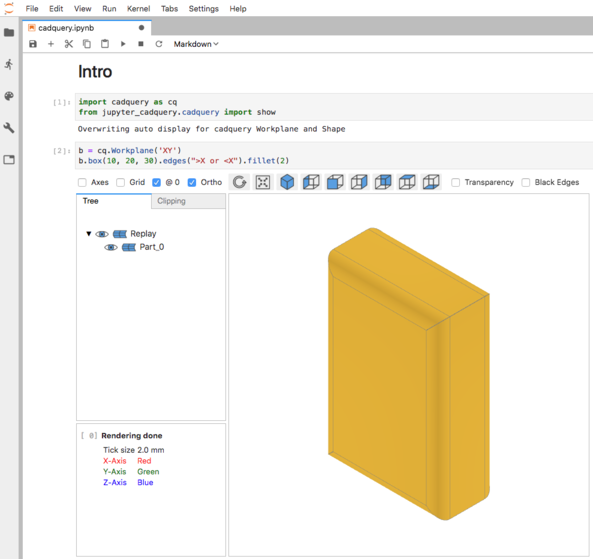

# jupyter-cadquery

An extension to render cadquery objects in JupyterLab via *[pythreejs](https://pythreejs.readthedocs.io/en/stable/)*.

**Note:** The extension relies on *PythonOCC* and will not run with the *FreeCAD* version of *CadQuery 1* or *CadQuery 2*.

## 1 Overview



### 1.1 Key features:

- Support for *CadQuery*, *CQParts* and *PythonOCC*
- Auto display of *CadQuery* shapes
- Viewer features
    - Jupyterlab sidecar support
    - Toggle visibilty of shapes and edges
    - Orthographic and perspective view
    - Clipping with max 3 clipping planes (of free orientation)
    - Transparency mode
    - Double click on shapes shows bounding box info
- Visual debugging by 
    - displaying selected *CadQuery* faces and edges
    - replaying steps of the rendered object


### 1.2 Example: CadQuery using Sidecar

```python
import cadquery as cq
from jupyter_cadquery.cadquery import (Assembly, Part, Edges, Faces, Vertices, show)
from jupyter_cadquery import set_sidecar

set_sidecar("CadQuery")

box1 = cq.Workplane('XY').box(10, 20, 30).edges(">X or <X").chamfer(2)
box2 = cq.Workplane('XY').box(8, 18, 28).edges(">X or <X").chamfer(2)
box3 = cq.Workplane('XY').transformed(offset=(0, 15, 7)).box(30, 20, 6).edges(">Z").fillet(3)
box4 = box3.mirror("XY").translate((0, -5, 0))

box1 = box1\
    .cut(box2)\
    .cut(box3)\
    .cut(box4)
 
a1 = Assembly(
    [
        Part(box1, "red box",   "#d7191c", show_edges=False),
        Part(box3, "green box", "#abdda4", show_edges=False),
        Part(box4, "blue box",  "#2b83ba", show_faces=False),
    ],
    "example 1"
)

show(a1, axes=True, grid=True, ortho=True, axes0=True)
```

 

## 2 Demos 

*(animated gifs)*

- [Features demo](doc/features.md) 
- [Clipping demo](doc/clipping.md) 
- [Faces-Edges-Vertices demo](doc/faces-edges-vertices.md) 
- [Replay demo](doc/replay.md) 
- [OCC demo](doc/occ.md) 
- [CQParts demo](doc/cqparts.md) 


## 3 Usage

### 3.1 Show objects

- **show(args)**
    - *cad_objs*: Comma separated list of cadquery objects
        **Note**: for OCC only one object is supported
    - *height* (`default=600`): Height of the CAD view
    - *tree_width* (`default=250`): Width of the object tree view
    - *cad_width* (`default=800`): Width of the CAD view
    - *quality* (default=`0.5`): Rendering quality
    - *axes* (`default=False`): Show X, Y and Z axis
    - *axes0* (`default=True`): Show axes at (0,0,0) or mass center
    - *grid* (`default=False`): Show grid
    - *ortho* (`default=True`): View in orthographic or perspective mode
    - *transparent* (`default=False`): View cadquery objects in transparent mode
    - *mac_scrollbar* (`default=True`): On macos patch scrollbar behaviour
    - *sidecar* (`default=None`): Use sidecar (False for none). Can be set globally with `set_sidecar`
    - *show_parents* (`default=True`): Show additionally parent of the current cadquery object

### 3.2 Assembly classes

- **Part**: A CadQuery shape plus some attributes for it:
    - *shape*: Cadquery shape
    - *name*: Part name in the view
    - *color*: Part color in the view
    - *show_faces*: show the faces of this particular part
    - *show_edges*: show the edges of this particular part

- **Faces**: Cadquery faces plus some attributes
    - *faces*: List of cadquery faces (`shape.faces(selector))`)
    - *name*: Part name in the view
    - *color*: Part color in the view
    - *show_faces*: show the faces for these particular faces
    - *show_edges*: show the edges for these particular faces

- **Edges**:
    - *edges*: List of cadquery edges (`shape.edges(selector))`)
    - *name*: Part name in the view
    - *color*: Part color in the view

- **Vertices**:
    - *vertices*: List of cadquery vertices (`shape.vertices(selector))`)
    - *name*: Part name in the view
    - *color*: Part color in the view

- **Assembly**: Basically a list of parts and some attributes for the view:
    - *name*: Assembly name in the view
    - *objects*: all parts and assemblies included in the assembly as a list


## 4 Installation

- Create a conda environment with Jupyterlab:

    ```bash
    conda create -n pycq python=3.6 numpy jupyterlab dataclasses
    conda activate pycq
    ```

- Install the latest versions of *CadQuery 2* for OCC:

    ```bash
    conda install -c conda-forge -c cadquery pythonocc-core=0.18.2 pyparsing python=3.6
    pip install --upgrade git+https://github.com/CadQuery/cadquery.git
    ```

- Install ipywidets, pythreejs and sidecar:

    ```bash
    pip install ipywidgets pythreejs sidecar
    jupyter labextension install @jupyter-widgets/jupyterlab-manager jupyter-threejs @jupyter-widgets/jupyterlab-sidecar
    ```

- Install jupyter-cadquery

    ```bash
    git clone https://github.com/bernhard-42/jupyter-cadquery.git
    cd jupyter-cadquery
    pip install .
    jupyter-labextension install js
    ```

## 5 Usage of a docker image

- Install [docker](https://www.docker.com)

- Run the docker container

    ```bash
    docker run -it --rm -v cq-data:/data -p 8888:8888 bernhard-42/jupyter-cadquery:latest
    ```

## 6 Credits

- Thomas Paviot for [python-occ](https://github.com/tpaviot/pythonocc-core). Ideas and some of the code in [cad_view._render_shape](jupyter_cadquery/cad_view.py) are derived/taken from his `jupyter_renderer.py`
- Dave Cowden for [CadQuery](https://github.com/dcowden/cadquery)
- Adam Urbańczyk for the OCC version of [CadQuery](https://github.com/CadQuery/cadquery/tree/master)

## 7 Known issues
- [z-fighting](https://en.wikipedia.org/wiki/Z-fighting) happens some times, especially when using multiple clip planes (cannot be solved in general)
- Using more than one clip plane will lead to cut surfaces not being shown as solid. (very hard to solve in general)