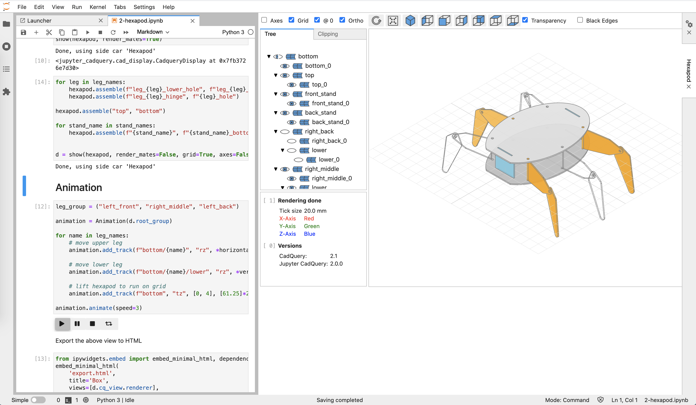

# jupyter-cadquery

An extension to render cadquery objects in JupyterLab via *[pythreejs](https://pythreejs.readthedocs.io/en/stable/)*.

**Note:** The extension relies on *PythonOCC* and will not run with the *FreeCAD* version of *CadQuery 1* or *CadQuery 2*.

## Quick use via Binder

Click on the icon to start *jupyter-cadquery* on binder:

[](https://mybinder.org/v2/gh/bernhard-42/jupyter-cadquery/master?urlpath=lab&filepath=examples%2Fcadquery.ipynb)

## Overview

The screenshot shows one of the official cadquery examples in *replay* mode with more than one build step being selected and visualized



### a) Key features:

- Support for *CadQuery*, *CQParts* and *PythonOCC*
- Auto display of *CadQuery* shapes
- Viewer features
    - Jupyterlab sidecar support
    - Toggle visibilty of shapes and edges
    - Orthographic and perspective view
    - Clipping with max 3 clipping planes (of free orientation)
    - Transparency mode
    - Double click on shapes shows bounding box info
- Visual debugging by
    - displaying selected *CadQuery* faces and edges
    - replaying steps of the rendered object


### b) Example: CadQuery using Sidecar

```python
import cadquery as cq
from jupyter_cadquery.cadquery import (Assembly, Part, Edges, Faces, Vertices, show)
from jupyter_cadquery import set_sidecar

set_sidecar("CadQuery")  # force usage of one cad view on the right

box1 = cq.Workplane('XY').box(10, 20, 30).edges(">X or <X").chamfer(2)
box2 = cq.Workplane('XY').box(8, 18, 28).edges(">X or <X").chamfer(2)
box3 = cq.Workplane('XY').transformed(offset=(0, 15, 7)).box(30, 20, 6).edges(">Z").fillet(3)
box4 = box3.mirror("XY").translate((0, -5, 0))

box1 = box1\
    .cut(box2)\
    .cut(box3)\
    .cut(box4)

a1 = Assembly(
    [
        Part(box1, "red box",   "#d7191c", show_edges=False),
        Part(box3, "green box", "#abdda4", show_edges=False),
        Part(box4, "blue box",  "#2b83ba", show_faces=False),
    ],
    "example 1"
)

show(a1, axes=True, grid=True, ortho=True, axes0=True)
```


## Installation

### a) Using conda

- **Create a conda environment with Jupyterlab:**

    - Download the environment definition files:

        ```bash
        wget https://raw.githubusercontent.com/bernhard-42/jupyter-cadquery/v0.9.3/environment.yml
        wget https://raw.githubusercontent.com/bernhard-42/jupyter-cadquery/v0.9.3/labextensions.txt
        ```

    - Create the conda environment and install the Jupyter labextensions

        ```bash
        conda env create -f ./environment.yml -n cq-jl
        conda activate cq-jl

        jupyter-labextension install --no-build $(cat labextensions.txt)
        jupyter lab build --dev-build=True --minimize=False
        ```

        Note, `jupyter-labextension list` should now show green "enabled OK" for “*@jupyter-widgets/jupyterlab-manager*, *@jupyter-widgets/jupyterlab-sidecar*, *jupyter-threejs*, *jupyter_cadquery* and *jupyterlab-datawidgets*

- **Run jupyter-cadquery**

    ```bash
    conda activate cq-jl
    jupyter lab
    ```

### b) Using a docker image

- Install [docker](https://www.docker.com)

- Build docker image

    ```bash
    cd docker
    IMAGE=bernhard-42/jupyter-cadquery:0.9.3
    docker build -t $IMAGE .
    ```

- Run the docker container

    ```bash
    WORKDIR=/tmp/jupyter
    docker run -it --rm -v $WORKDIR:/data/workdir -p 8888:8888 $IMAGE
    ```

    **Note:** Don't store new notebooks in the `examples` folder, **they will be lost**. Use the `workdir` folder that is mapped to a local persistent folder on the host.

## Demos

*(animated gifs)*

- [Features demo](doc/features.md)
- [Clipping demo](doc/clipping.md)
- [Faces-Edges-Vertices demo](doc/faces-edges-vertices.md)
- [Replay demo](doc/replay.md) (*experimental*)
- [OCC demo](doc/occ.md)
- [CQParts demo](doc/cqparts.md)


## Usage

### a) Show objects

- `show(args)`

    args:

    - `cad_objs`: Comma separated list of cadquery objects; **Note**: For OCC only one object is supported
    - `height` (`default=600`): Height of the CAD view
    - `tree_width` (`default=250`): Width of the object tree view
    - `cad_width` (`default=800`): Width of the CAD view
    - `quality` (`default=0.5`): Rendering quality
    - `axes` (`default=False`): Show X, Y and Z axis
    - `axes0` (`default=True`): Show axes at (0,0,0) or mass center
    - `grid` (`default=False`): Show grid
    - `ortho` (`default=True`): View in orthographic or perspective mode
    - `transparent` (`default=False`): View cadquery objects in transparent mode
    - `mac_scrollbar` (`default=True`): On macos patch scrollbar behaviour
    - `sidecar` (`default=None`): Use sidecar (False for none). Can be set globally with `set_sidecar`
    - `show_parents` (`default=True`): Show additionally parent of the current cadquery object

### b) Replay objects

- `replay(args)`

    args:

    - `cad_obj`: cadquery object
    - `index` (`default=0`): Element in the fluent API stack to show
    - `debug` (`default=False`): Trace building the replay stack
    - `cad_width` (`default=600`): Width of the CAD view
    - `height` (`default=600`): Height of the CAD view

### c) Export the rendered object as STL:

- OCC

    ```python
    from jupyter_cadquery import exportSTL

    exportSTL(a1, "a1.stl", linear_deflection=0.01, angular_deflection=0.1)
    ```

    Lower `linear_deflection` and `angular_deflection` means more details.

### d) Export the rendering view as HTML:

A straight forward approach is to use

```python
w = show(a1)
```

adapt the cad view as wanted (axis, viewpoint, transparency, ...) and then call

```python
from ipywidgets.embed import embed_minimal_html
embed_minimal_html('export.html', views=[w.cq_view.renderer], title='Renderer')
```

Using `w.cq_view.renderer` this will save the exact state of the visible pythreejs view.

Of course, you can also call `w = show(a1, *params)` where `params` is the dict of show parameters you'd like to be used and then call the `embed_minimal_html` with `views=w.cq_view.renderer`

Notes:

1. If you use `sidecar`then you need to close it first:

    ```
    from jupyter_cadquery import cad_display
    cad_display.SIDECAR.close()
    ```

2. Buttons and treeview can be exported, however the interaction logic of the UI is implemented in Python. So the treeview and the buttons won't have any effect in an exported HTML page.


## Jupyter_cadquery classes

- `Part`: A CadQuery shape plus some attributes for it:
    - `shape`: Cadquery shape
    - `name`: Part name in the view
    - `color`: Part color in the view
    - `show_faces`: show the faces of this particular part
    - `show_edges`: show the edges of this particular part

- `Faces`: Cadquery faces plus some attributes
    - `faces`: List of cadquery faces (`shape.faces(selector))`)
    - `name`: Part name in the view
    - `color`: Part color in the view
    - `show_faces`: show the faces for these particular faces
    - `show_edges`: show the edges for these particular faces

- `Edges`:
    - `edges`: List of cadquery edges (`shape.edges(selector))`)
    - `name`: Part name in the view
    - `color`: Part color in the view

- `Vertices`:
    - `vertices`: List of cadquery vertices (`shape.vertices(selector))`)
    - `name`: Part name in the view
    - `color`: Part color in the view

- `Assembly`: Basically a list of parts and some attributes for the view:
    - `name`: Assembly name in the view
    - `objects`: all parts and assemblies included in the assembly as a list


## Credits

- Thomas Paviot for [python-occ](https://github.com/tpaviot/pythonocc-core). Ideas and some of the code in [cad_view._render_shape](jupyter_cadquery/cad_view.py) are derived/taken from his `jupyter_renderer.py`
- Dave Cowden for [CadQuery](https://github.com/dcowden/cadquery)
- Adam Urbańczyk for the OCC version of [CadQuery](https://github.com/CadQuery/cadquery/tree/master)

## Known issues

- [z-fighting](https://en.wikipedia.org/wiki/Z-fighting) happens some times, especially when using multiple clip planes (cannot be solved in general)
- Using more than one clip plane will lead to cut surfaces not being shown as solid. (very hard to solve in general)
