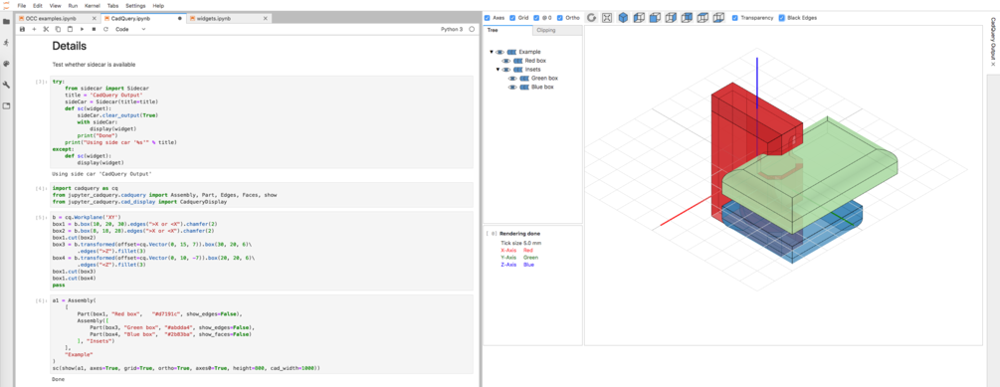
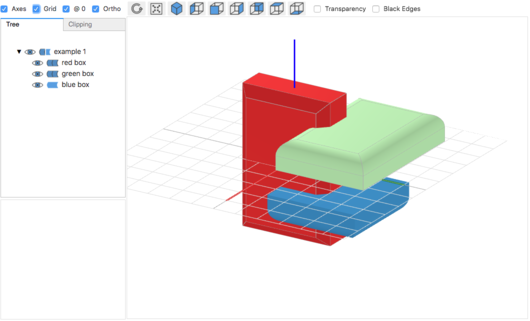
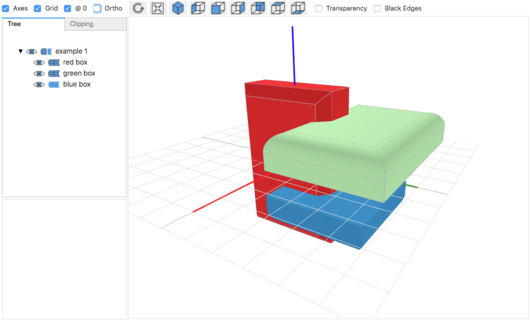
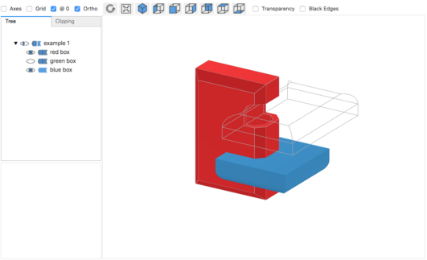
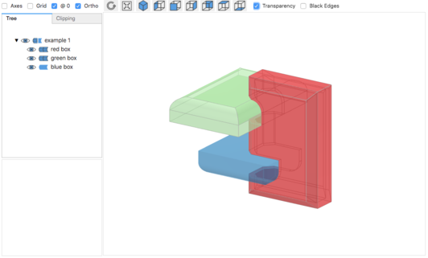
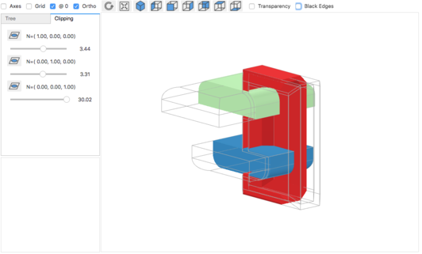
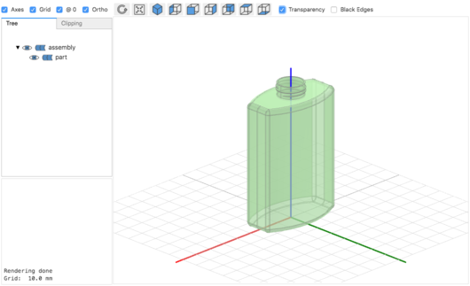
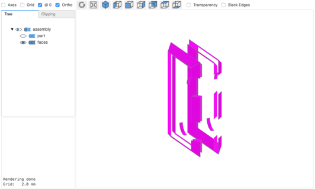
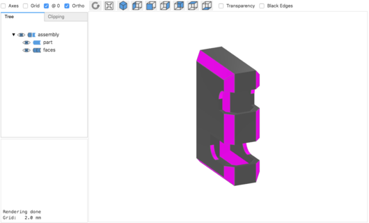
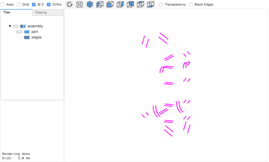

# jupyter-cadquery

An extension to render cadquery objects in JupyterLab via *[pythreejs](https://pythreejs.readthedocs.io/en/stable/)*.


**Note:** The extension relies on *PythonOCC* and will not run with the *FreeCAD* version of *CadQuery 1* or *CadQuery 2*.

## Overview

### Key features:

- Support for *CadQuery* and *PythonOCC* shapes
- Switch between Orthographic and Perspective view
- Auto display of *CadQuery* shapes
- Double click on shapes shows bounding box info in output widget
- Visual debugging by displaying selected *CadQuery* faces and edges
- Transparency mode
- Toggle visibilty of shapes and edges
- Clipping with max 3 clipping planes (of free orientation)
- Supports (Jupyterlab Sidecar)[https://github.com/jupyter-widgets/jupyterlab-sidecar]


### Samples

#### Jupyterlab Sidecar

- [Sidecar Support](screenshots/sidecar.png)

    

#### CadQuery

```python
import cadquery as cq
from jupyter_cadquery.cadquery import Assembly, Part, Edges, Faces, show

b = cq.Workplane('XY')
box1 = b.box(10, 20, 30).edges(">X or <X").chamfer(2)
box2 = b.box(8, 18, 28).edges(">X or <X").chamfer(2)
box1.cut(box2)
box3 = b.transformed(offset=cq.Vector(0, 15, 7)).box(30, 20, 6)\
        .edges(">Z").fillet(3)
box4 = b.transformed(offset=cq.Vector(0, 10, -7)).box(20, 20, 6)\
        .edges("<Z").fillet(3)
box1.cut(box3)
box1.cut(box4)

a1 = Assembly(
    [
        Part(box1, "red box",   "#d7191c", show_edges=False),
        Part(box3, "green box", "#abdda4", show_edges=False),
        Part(box4, "blue box",  "#2b83ba", show_faces=False),
    ],
    "example 1"
)

show(a1, axes=True, grid=True, ortho=True, axes0=True)
```

- [Orthographic view](screenshots/1_ortho.png)

    

- [Perspective view](screenshots/2_perspective.png)

    

- [Hiding edges and shapes](screenshots/3_ortho_with_hidden_features.png)

    

- [Transparency](screenshots/4_transparency.png)

    

- [Clipping with up to 3 clipping planes](screenshots/5_clipping.png)

    

#### PythonOCC

See [core_classic_occ_bottle.py](https://github.com/tpaviot/pythonocc-demos/blob/master/examples/core_classic_occ_bottle.py), however omit lines in the `main`part

```python
from jupyter_cadquery.occ import Part, Assembly, show

# ...

# Build the resulting compound
bottle = TopoDS_Compound()
aBuilder = BRep_Builder()
aBuilder.MakeCompound(bottle)
aBuilder.Add(bottle, myBody.Shape())
aBuilder.Add(bottle, myThreading)
print("bottle finished")

# No main lines

Part(bottle, color="#abdda4")
```

[Classic OCC bottle](screenshots/occ_bottle.png)




### Visual debugging in *CadQuery

- By showing faces [without](screenshots/6_faces.png) or [with](screenshots/7_faces_and_part.png) their shape `box1.faces("not(|Z or |X or |Y)")`

    
    

- By showing edges [without](screenshots/8_edges.png) or [with](screenshots/9_edges_and_part.png) their shape `box1.edges("not(|X or |Y or |Z)")`

    
    

## Usage

Own classes for assemblies

- **Part**: A CadQuery shape plus some attributes for it:
    - *shape*: Cadquery shape
    - *name*: Part name in the view
    - *color*: Part color in the view
    - *show_faces*: show the faces of this particular part
    - *show_edges*: show the edges of this particular part

- **Faces**: Cadquery faces plus some attributes
    - *faces*: List of cadquery faces (`shape(faces(selctor))`)
    - *name*: Part name in the view
    - *color*: Part color in the view
    - *show_faces*: show the faces for these particular faces
    - *show_edges*: show the edges for these particular faces

- **Edges**:
    - *edges*: List of cadquery edges (`shape(edges(selctor))`)
    - *name*: Part name in the view
    - *color*: Part color in the view

- **Assembly**: Basically a list of parts and some attributes for the view:
    - *name*: Assembly name in the view
    - *objects*: all parts and assemblies included in the assembly as a list

## Installation

- Create a conda environment with Jupyterlab:

    ```bash
    conda create -n pycq python=3.6 numpy jupyterlab
    conda activate pycq
    ```

- Install the latest versions of *CadQuery 2* for OCC:

    ```bash
    conda install -c conda-forge -c cadquery pythonocc-core=0.18.2 pyparsing python=3.6
    pip install --upgrade git+https://github.com/CadQuery/cadquery.git@adam-urbanczyk-csg-combine-fix
    ```

- Install ipywidets, pythreejs and sidecar:

    ```bash
    pip install ipywidgets pythreejs sidecar
    jupyter labextension install @jupyter-widgets/jupyterlab-manager jupyter-threejs @jupyter-widgets/jupyterlab-sidecar
    ```

- Install jupyter-cadquery

    ```bash
    git clone https://github.com/bernhard-42/jupyter-cadquery.git
    cd jupyter-cadquery
    pip install .
    jupyter-labextension install js
    ```

## Usage of a docker image

- Install [docker](https://www.docker.com)

- Run the docker container

    ```bash
    docker run -it --rm -v cq-data:/data -p 8888:8888 bernhard-42/jupyter-cadquery:latest
    ```

## Credits

- Thomas Paviot for [python-occ](https://github.com/tpaviot/pythonocc-core). Ideas and some of the code in [cad_view._render_shape](jupyter_cadquery/cad_view.py) are derived/taken from `pythonocc-core/.../src/Display/WebGl/jupyter_renderer.py`
- Dave Cowden for [CadQuery](https://github.com/dcowden/cadquery)
- Adam Urbańczyk for the OCC version of [CadQuery](https://github.com/CadQuery/cadquery/tree/master)

## Known issues
- [z-fighting](https://en.wikipedia.org/wiki/Z-fighting) happens some times, especially when using multiple clip planes (cannot be solved in general)
- Using more than one clip plane will lead to cut surfaces not being shown as solid. (very hard to solve in general)