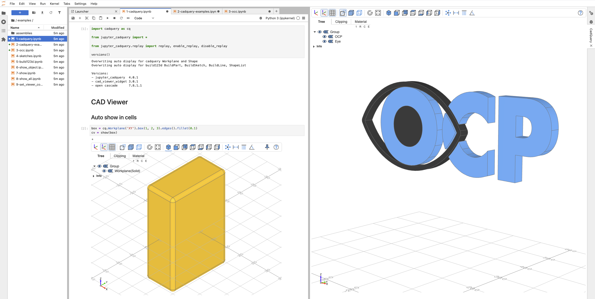
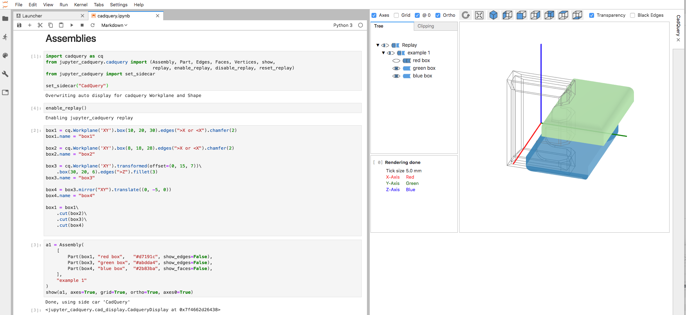
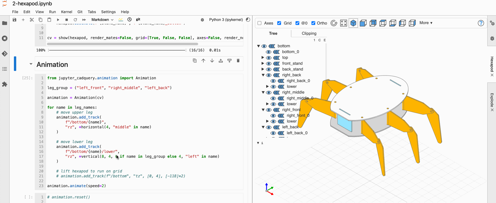
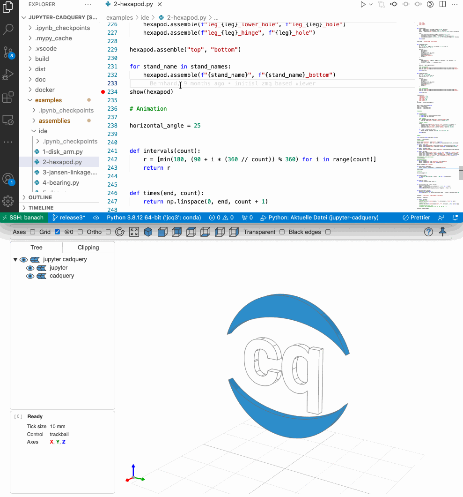

# Jupyter-CadQuery

View [CadQuery](https://github.com/cadquery/cadquery) objects in JupyterLab or in a standalone viewer for any IDE



Click on the "launch binder" icon to start _Jupyter-CadQuery_ on binder:

[](https://mybinder.org/v2/gh/bernhard-42/jupyter-cadquery/master?urlpath=lab&filepath=examples%2Fassemblies%2F1-disk-arm.ipynb)

## Release v3.0.0rc5 (20.02.2022)

### Overview

Release 3 is a complete rewrite of _Jupyter-CadQuery_: While the selection of _[pythreejs](https://github.com/jupyter-widgets/pythreejs)_ and JupyterLab's _[sidecar](https://github.com/jupyter-widgets/jupyterlab-sidecar)_ looked reasonable in 2019, it turned out they had too many limitations. _pythreejs_ is stuck with an outdated version of _[threejs](https://github.com/mrdoob/three.js/)_ and the _sidecar_ project did not improve usability to a level I would have liked to have.

_Jupyter-CadQuery_ is now a 3 layer project:

1. **[three-cad-viewer](https://github.com/bernhard-42/three-cad-viewer)**
   This is the complete CAD viewer written in Javascript with _[threejs](https://github.com/mrdoob/three.js/)_ being the only dependency. There is are a bunch of [live examples](https://bernhard-42.github.io/three-cad-viewer/example.html) and an [API documentation](https://bernhard-42.github.io/three-cad-viewer/Viewer.html). This layer could also serve as the viewer for a CadQuery integration into VS Code (anybody willing to give it a try?)

2. **[cad-view-widget](https://github.com/bernhard-42/cad-viewer-widget)**
   A thin layer on top of _cad-viewer-widget_ that wraps the CAD viewer into an [ipywidget](https://github.com/jupyter-widgets/ipywidgets). The API documentation can be found [here](https://bernhard-42.github.io/cad-viewer-widget/cad_viewer_widget/index.html)

3. **jupyter-cadquery** (this repository)
   The actual CadQuery viewer, collecting and tessellating CadQuery objects, using _cad-view-widget_ to visualize the objects. It was written with the intent to be as compatible with Jupyter-CadQuery 2.x as reasonable.

   **Note:** For changes see the migration section at the end of this page.

### New features

- **Performance**

  - By removing the back and forth communication from pythreejs (Python) to Javascript (threejs), the new version is significantly faster in showing multi object assemblies.

- **CadQuery feature support**

  - Supports the latest **CadQuery Sketch class**.

- **New CAD View Controller**

  - Besides the _orbit_ controller (with z-axis being restricted to show up) it now also supports a **trackball controller** with full freedom of moving the CAD objects. The trackball controller uses the holroyd algorithm (see e.g. [here](https://www.mattkeeter.com/projects/rotation/)) to have better control of movements and avoid the usual trackball tumbling.

- **A full re-implementation of Sidecar**

  - Sidecars will be **reused** based on name of the sidecar
  - Supports **different anchors** (_right_, _split-right_, _split-left_, _split-top_, _split-bottom_).
  - Sidecars opening with anchor _right_ will adapt the size to the the size of the CAD view

- **WebGL contexts**

  - In a browser only a limited number of WebGL context can be shown at the same time (e.g. 16 in Chrome on my Mac). Hence, _Jupyter-CadQuery_ now thoroughly tracks WebGL contexts, i.e. **releases WebGL context** when sidecar gets closed.

- **Replay mode**

  - Supports **CadQuery Sketch class**.
  - Replay mode now can **show bounding box** instead of result to compare step with result.

- **New features**

  - _Jupyter-CadQuery_ now allows to show **all three grids** (xy, xz, yz).
  - `show_bbox` additionally shows the bounding box.
  - CAD viewer icons are scalable svg icons.
  - Clipping supports an **intersection mode**.
  - The animation controller is now part of the Javascript component.
  - export_html exports the whole view (with tools) as a HTML page
  - export_png export the CAD view (without tools) as a PNG

**Fixes**

- more than I can remember (or am willing to read out of git log) ...

## Key Features

- CadQuery support
  - Supports _CadQuery >= 2.1_ including _master_ (as of 2021-02-14)
- Viewing options:
  - Directly in the JupyterLab output cell
  - In a central Jupyterlab sidecar for any JupyterLab cell (see example 1 below)
  - As a standalone viewer for use from any IDE (see example 3 below)
- Viewer features
  - Toggle visibility of shapes and edges
  - Orthographic and perspective view
  - Clipping with max 3 clipping planes (of free orientation)
  - Transparency mode
  - Double click on shapes shows bounding box info
- Assemblies
  - Supports [CadQuery Assemblies](https://cadquery.readthedocs.io/en/latest/assy.html)
- Animations
  - Support [Manual Assemblies](https://github.com/bernhard-42/cadquery-massembly) with animation of models (see example 2 and 3 below)
- Sketches
  - Support Sketch class for both `show` and `replay`
- Auto display of _CadQuery_ shapes
- Visual debugging by
  - displaying selected _CadQuery_ faces and edges
  - replaying steps of the rendered object (note, this is not supported in the standalone viewer)

## Examples

1. **Simple Example in JupyterLab using Sidecar (light theme)**

   

   To try this yourself, you can use the code [here](#example-code)

2. **Animation system in JupyterLab**

   

3. **Debugging in VS Code with Standalone Viewer**

   

   Note:

   - The top half is the CadQuery code being debugged in VS Code
   - The bottom half is the standalone viewer in a browser window
   - The `show` command in the code will tessellate the objects and send them via [zmq](https://pyzmq.readthedocs.io/en/latest/) to the standalone viewer

## Installation

### Using conda

1. For using _Jupyter-CadQuery_ **in Jupyterlab**

   - If you don't have it already, create a new conda environment with the latest CadQuery (e.g. master)
     ```bash
     conda create -n jcq3 -c conda-forge -c cadquery python=3.8 cadquery=master
     conda activate jcq3
     ```
   - Install _Jupyter-CadQuery_ (note, matplotlib is only used for the examples)
     ```bash
     pip install jupyter-cadquery==3.0.0rc5 matplotlib
     ```
     Windows users should also install `pywin32` again with `conda` to ensure it is configured correctly
     ```bash
     conda install pywin32
     ```
   - Start _Jupyter-CadQuery_

     ```bash
     conda activate jcq3
     jupyter lab
     ```

   - If you use the dark theme of JuypterLab, add the following code in the first cell of your notebook:

     ```python
     [1]: from jupyter_cadquery import set_defaults, open_viewer
          set_defaults(theme="dark")
          open_viewer("CadQuery")
     ```

2. For running _Jupyter-CadQuery_ as **standalone viewer**

   - Start the browser based viewer

     ```bash
     conda activate jcq3
     jcv [-w width] [-h height]     # light theme
     jcv [-w width] [-h height] -d  # dark theme
     ```

   - Use it from an IDE:
     In your code import the `show` or `show_object` function from the viewer:

     ```python
     import cadquery as cq
     from jupyter_cadquery.viewer.client import show, show_object
     obj = cq. ...
     show(obj) # or show_object(obj)
     ```

     `show` works as in JupyterLab, while `show_object` views objects incrementally as in CQ-Editor

### Using a docker image

1. For using _Jupyter-CadQuery_ **in Jupyterlab**

   - Start _Jupyter-Cadquery_

     ```bash
     WORKDIR=/tmp/jupyter
     mkdir -p "$WORKDIR"  # this has to exist, otherwise an access error will be thrown
     docker run -it --rm -v $WORKDIR:/home/cq -p 8888:8888 bwalter42/jupyter_cadquery:3.0.0rc5
     ```

     Jupyter in the container will start in directory `/home/cq`

   - To start with examples, you can

     - omit the volume mapping and just run `docker run -it --rm -p 8888:8888 bwalter42/jupyter_cadquery:3.0.0rc5` or
     - copy the example notebooks to your `$WORKDIR`. They will be available for _Jupyter-CadQuery_ in the container.

   - If you want to change the Dockerfile, `make docker` will create a new docker image

2. For running _Jupyter-CadQuery_ as **standalone viewer**

   - Start the browser based viewer:

     ```bash
     docker run -it --rm -p 8888:8888 -p 5555:5555 bwalter42/jupyter_cadquery:3.0.0rc5 -v [-d]
     ```

   - In your code import the `show` or `show_object` function from the viewer:

     ```python
     import cadquery as cq
     from jupyter_cadquery.viewer.client import show, show_object
     obj = cq. ...
     show(obj) # or show_object(obj)
     ```

     `show` works as in JupyterLab, while `show_object` views objects incrementally as in CQ-Editor

Notes:

- To simplify port forwarding, the viewer in the docker container also starts with port 8888 (and not with voila's default port 8866)
- Port 5555 (the zmq port) needs to be forwarded. The `show` of the viewer client will send cad objects to this port
- Use `-d` for dark mode and `-w`, `-h` to set dimensions of the CAD viewer

## Demo Notebooks

- [A run through of all features](./examples/1-cadquery.ipynb)
- [Standard CadQuery examples in Jupyter CadQuery](./examples/2-cadquery-examples.ipynb)
- [An OCP example (the OCC bottle)](./examples/3-occ.ipynb)
- [CadQuery Sketch support](./examples/4-sketches.ipynb)
- Animated `MAssembly` examples:
  - Jupyter notebooks
    - [Rotating disk arm](./examples/assemblies/1-disk-arm.ipynb)
    - [Hexapod](./examples/assemblies/2-hexapod.ipynb)
    - [Jansen Linkage](./examples/assemblies/3-jansen-linkage.ipynb)
    - [CadQuery's door assembly example](./examples/assemblies/5-door.ipynb)
    - [A nested Assembly](./examples/assemblies/6-nested-assemblies.ipynb)
  - IDE plus Viewer:
    - [Rotating disk arm](examples/ide/1-disk_arm.py)
    - [Hexapod](examples/ide/2-hexapod.py)
    - [Jansen Linkage](examples/ide/3-jansen-linkage.py)
    - [CadQuery's door assembly example](examples/ide/5-door.py)
    - [A nested Assembly](examples/ide/6-nested-assemblies.py)

## Usage

### a) Show objects

**`show(cad_objs, **kwargs)`\*\*

_Positional arguments `args`:_

- `cad_objs`: Comma separated list of cadquery objects;

_Keywork arguments `kwargs`:_

- Display options

  - `viewer`: Name of the sidecar viewer (default=None)
  - `anchor`: How to open sidecar: "right", "split-right", "split-bottom", ... (default="right")
  - `cad_width`: Width of CAD view part of the view (default=800)
  - `tree_width`: Width of navigation tree part of the view (default=250)
  - `height`: Height of the CAD view (default=600)
  - `theme`: Theme "light" or "dark" (default="light")
  - `pinning`: Allow replacing the CAD View by a canvas screenshot (default=True in cells, else False)

- Tessellation options

  - `angular_tolerance`: Shapes: Angular deflection in radians for tessellation (default=0.2)
  - `deviation`: Shapes: Deviation from linear deflection value (default=0.1)
  - `edge_accuracy`: Edges: Precision of edge discretization (default=None, i.e. mesh quality / 100)
  - `default_color`: Default face color (default=(232, 176, 36))
  - `default_edge_color`: Default edge color (default="#707070")
  - `optimal_bb`: Use optimal bounding box (default=False)
  - `render_normals`: Render the vertex normals (default=False)
  - `render_edges`: Render edges (default=True)
  - `render_mates`: Render mates (for MAssemblies, default=False)
  - `mate_scale`: Scale of rendered mates (for MAssemblies, default=1)

- Viewer options

  - `control`: Use trackball controls ('trackball') or orbit controls ('orbit') (default='trackball')
  - `axes`: Show axes (default=False)
  - `axes0`: Show axes at (0,0,0) (default=False)
  - `grid`: Show grid (default=[False, False, False])
  - `ticks`: Hint for the number of ticks in both directions (default=10)
  - `ortho`: Use orthographic projections (default=True)
  - `transparent`: Show objects transparent (default=False)
  - `black_edges`: Show edges in black (default=False)
  - `position`: Absolute camera position that will be scaled (default=None)
  - `quaternion`: Camera rotation as quaternion (x, y, z, w) (default=None)
  - `target`: Camera target to look at (default=None)
  - `zoom`: Zoom factor of view (default=2.5)
  - `reset_camera`: Reset camera position, rotation and zoom to default (default=True)
  - `zoom_speed`: Mouse zoom speed (default=1.0)
  - `pan_speed`: Mouse pan speed (default=1.0)
  - `rotate_speed`: Mouse rotate speed (default=1.0)
  - `ambient_intensity`: Intensity of ambient light (default=0.75)
  - `direct_intensity`: Intensity of direct lights (default=0.15)
  - `show_parent`: Show the parent for edges, faces and vertices objects
  - `show_bbox`: Show bounding box (default=False)
  - `tools`: Show the viewer tools like the object tree (default=True)
  - `timeit`: Show rendering times, levels = False, 0,1,2,3,4,5 (default=False)
  - `js_debug`: Enable debug output in browser console (default=False)

- Not supported any more:

  - `mac_scrollbar`: The default now
  - `bb_factor`: Removed
  - `display`: Use 'viewer="<viewer title>"' (for sidecar display) or 'viewer=None' (for cell display)
  - `quality`: Use 'deviation'to control smoothness of rendered edges

### b) Manage default values

- **`set_defaults(**kwargs)`:** allows to globally set the defaults value so they do not need to be provided with every `show` call

  kwargs:

  - see `show`

- **`get_default(value)`:** Get the global default for a single `value`
- **`get_defaults()`:** Get all global defaults
- **`reset_defaults()`**: Reset all defaults back to its initial value

### c) Replay objects

Note, this is not supported in the standalone viewer for the time being.

- **`replay(args)`**

  _Argument `args`:_

  - `cad_obj`: cadquery object
  - `index` (`default=0`): Element in the fluent API stack to show
  - `debug` (`default=False`): Trace building the replay stack
  - `cad_width` (`default=600`): Width of the CAD view
  - `height` (`default=600`): Height of the CAD view

### d) Exports:

- **Export as PNG:**

  Display your object via

  ```python
  cv = show(a1)
  ```

  and adapt the cad view as wanted (camera location, axis, transparency, ...).

  Then call

  ```python
  cv.export_png("example.png")
  ```

- **Export as HTML:**

  Display your object without using a sidecar (set `viewer` to `None`) via

  ```python
  cv = show(a1, viewer=None)
  ```

  and adapt the cad view as wanted (camera location, axis, transparency, ...).

  Then call

  ```python
  cv.export_html()
  ```

  Note: This does not work with viewers in sidecars!

- **Export as STL:**

  For CadQuery objects use CadQuery export functions. For `PartGroup`s the following code can be used:

  ```python
  from jupyter_cadquery.export import exportSTL

  exportSTL(
    part_group, "pg.stl", tolerance=quality, angular_tolerance=angular_tolerance
  )
  ```

  Smaller `linear_deflection` and `angular_deflection` means more details.

## Jupyter-CadQuery classes

- `Part`: A CadQuery shape plus some attributes for it:

  - `shape`: CadQuery shape
  - `name`: Part name in the view
  - `color`: Part color in the view
  - `show_faces`: show the faces of this particular part
  - `show_edges`: show the edges of this particular part

- `Faces`: CadQuery faces plus some attributes

  - `faces`: List of CadQuery faces (`shape.faces(selector))`)
  - `name`: Part name in the view
  - `color`: Part color in the view
  - `show_faces`: show the faces for these particular faces
  - `show_edges`: show the edges for these particular faces

- `Edges`:

  - `edges`: List of CadQuery edges (`shape.edges(selector))`)
  - `name`: Part name in the view
  - `color`: Part color in the view

- `Vertices`:

  - `vertices`: List of CadQuery vertices (`shape.vertices(selector))`)
  - `name`: Part name in the view
  - `color`: Part color in the view

- `PartGroup`: Basically a list of parts and some attributes for the view:
  - `name`: PartGroup name in the view
  - `objects`: all parts and assemblies included in the assembly as a list

## Migration from 2.x

**Deprecations:**

- Import structure changed:
  - `from jupyter_cadquery.cadquery import show, ...` will raise a deprecation error:
    Use `from jupyter_cadquery import show, ...` instead.
  - `from jupyter_cadquery.occ import show, ...` will raise a deprecation error:
    Use `from jupyter_cadquery import show, ...` instead.
  - `from jupyter_cadquery.animation import Animation` will raise a deprecation error:
    Use `from jupyter_cadquery.cad_animation import Animation` instead.
- Sidecar handling changed
  - `set_sidecar(title, init=True)` will raise a deprecation error:
    Use `open_viewer(title)` instead.
  - `close_sidecar()` will raise a deprecation error:
    Use `close_viewer(title)` instead.
  - `close_sidecars()` will raise a deprecation error:
    Use `close_viewers(title)` instead.
- Change parameters:
  - Parameter `grid` is now a tuple `(xy-grid, xz-grid, yz-grid)` instead of a boolean. A deprecation warning will be shown and the tuple `(grid, False, False)` used to invoke the old behavior.

**Changed behavior:**

- The replay mode now shows the result's bounding box as top level step by default instead of the result. Use `show_result=True` for the old behavior.
- New parameters `viewer` and `anchor` of function `show` set a sidecar (with title <viewer>) and `anchor` to determine location of the sidecar (`right`, `split-right`, `split-left`, `split-top`, `split-bottom`).
- The parameter `rotation` of function `show` has been replaced by `quaternion`, since the new viewer uses quaternions instead of Euler angles.
- The parameter `quality` is ignored. Use `deviation` to control smoothness of rendered edges.
- In 7.5 of opencascade something changed with color handling, so some colors might be different.
- The default view does not render the back material, making transparent views brighter. When switching to clipping view, the back material will set to the edge color to give the impression of cut planes. This means that transparent object look darker.

**Parameters of function `show` and `set_defaults` not supported any more:**

- `mac_scrollbar`: This is used as default now.
- `bb_factor`: Not necessary any more.
- `display`: For sidecar display use `viewer="<viewer title>"` and for cell display use `viewer=None`.

## Credits

- Thomas Paviot for [python-occ](https://github.com/tpaviot/pythonocc-core). Ideas are derived/taken from his `jupyter_renderer.py`
- Dave Cowden for [CadQuery](https://github.com/dcowden/cadquery)
- Adam Urbańczyk for the OCP version of [CadQuery](https://github.com/CadQuery/cadquery/tree/master)

## Known issues

- [z-fighting](https://en.wikipedia.org/wiki/Z-fighting) happens some times, especially when using multiple clip planes (cannot be solved in general)
- Using more than one clip plane will lead to cut surfaces not being shown as solid. (very hard to solve in general)
