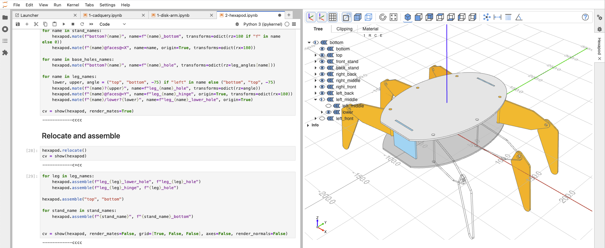
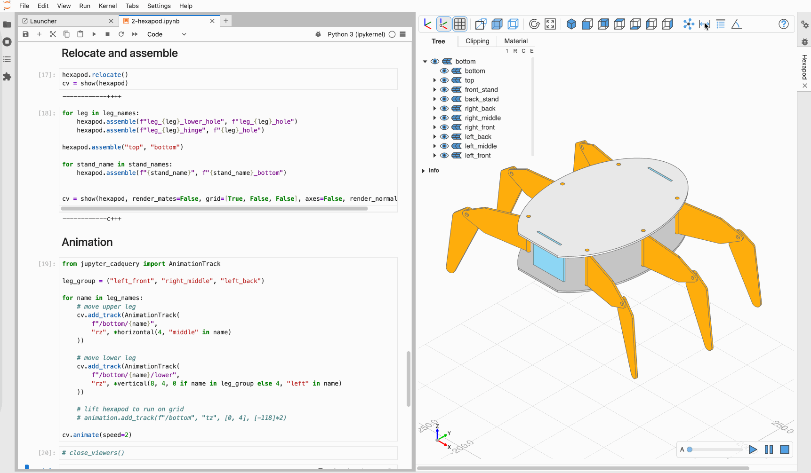
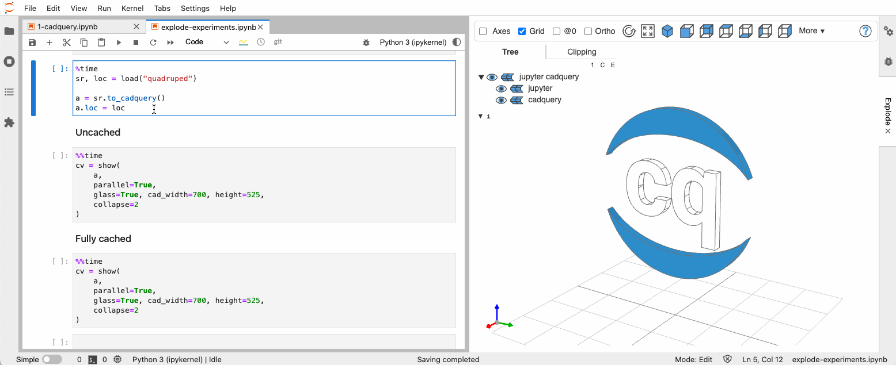
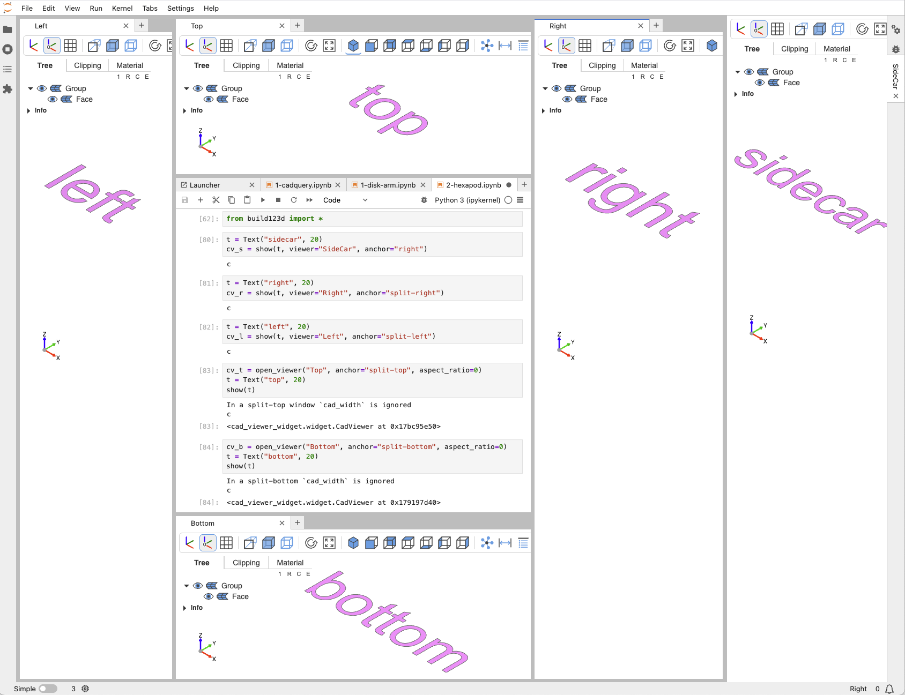

# Jupyter for CadQuery / build123d

The Python package provides a Jupyterlab extension and a JupyterServer extension to view [CadQuery](https://github.com/cadquery/cadquery), [build123d](https://github.com/gumyr/build123d), and [OCP](https://github.com/cadquery/OCP) objects in JupyterLab

Current version: **v4.0.2** (2025-04-17)


<!-- 
Click on the "launch binder" icon to start _Jupyter-CadQuery_ on binder:

[](https://mybinder.org/v2/gh/bernhard-42/jupyter-cadquery/master?urlpath=lab&filepath=examples%2Fassemblies%2F1-disk-arm.ipynb) 
-->

## Table of contents

- [Overview](#overview)
- [Key Features](#key-features)
- [Examples](#examples)
- [Installation](#installation)
- [Standalone version](#standalone-version)
- [Demo Notebooks](#demo-notebooks)
- [Usage](#usage)
- [Release v4](release-v4)
- [Migration from 3.x](#migration-from-3x)
- [Known issues](#known-issues)


## Overview

_Jupyter-CadQuery_  release 4 is a complete rewrite of _Jupyter-CadQuery_ 3: 

It is now based on:

- the show logic provided by [ocp_vscode](https://github.com/bernhard-42/vscode-ocp-cad-viewer) (_OCP CAD Viewer for VS Code_),
- the viewer is [three-cad-viewer](https://github.com/bernhard-42/three-cad-viewer)
- the tessellation logic provided by [ocp-tessellate](https://github.com/bernhard-42/ocp-tessellate),
- the communication between Python and Javascript provided by [cad-viewer-widget](https://github.com/bernhard-42/cad-viewer-widget), a custom [ipywidget](https://github.com/jupyter-widgets/ipywidgets),
- and the new (!) measurement feature provided again by [ocp_vscode](https://github.com/bernhard-42/vscode-ocp-cad-viewer)

**Note:** For changes see the migration section at the end of this page.

## Key Features

- Code CAD support
  - _CadQuery >= 2.5_ including _master_ (as of 2025-04)
  - _build123d_ >=0.9 including _master_ (as of 2025-04)
  - _OCP_ == 7.8.X (as of 2025-04)

- Viewing options:
  - Directly in the JupyterLab output cell
  - In a central Jupyterlab sidecar
  - In separate windows in Jupyter lab
  - For sidecar and windows based viewers, the viewers resize with the size of the container window. You can have a fixed aspect ratio (height to width ratio) or fill the complete container window.
  - Auto display of _CadQuery_ and _build123d_ shapes
  - Replay mode for CadQuery objects

- Animations (see examples below)
  - Support [animated CadQuery assemblies](https://github.com/bernhard-42/cadquery-massembly)
  - Support [animated build123d assemblies](https://github.com/bernhard-42/bd_animation)
  - Animated explode mode for _CadQuery_ and _build123d_ assemblies

- Viewer features
  - Clipping with max 3 clipping planes (of free orientation) with cap faces being properly shown
  - Toggle visibility of shapes and edges
  - Orthographic and perspective view
  - Simple material editor (light intensity, metalness and roughness)
  - Transparency mode
  - Double click on shapes shows bounding box info
  - Click on tree labels shows bounding box info and optionally hides or isolates the elements (use the modifier keys described in online help)


## Examples

### The viewer

It allows to view CAD objects with or without grid, using orthographic or perspective camera and many more viewing features.



### Measurement mode

I allows to measure distance of objects, angle beween edges and faces and show propertis like center, are volume for objects selected



### Animation System - explode assemblies

The animation system allows to explode CadQuery and build123d assemblies or group of CAD objects. The epxplosion center is (0,0,0).



### Animation System - Self defined animation

The animation system also allows to create custom defined animations like this animated hexapod.

  


## Installation

### Installation

- **CadQuery**

  1. Create and activate a virtual conda environment

      ```bash
      mamba create -n jcq4 python=3.12.9
      mamba activate jcq4
      ```

  2. Install latest cadquery master

      ```bash
      mamba install -c conda-forge -c cadquery cadquery=master
      ```

  3. Install Jupyter CadQuery  **(use preview installation approach for now)**

      ```bash
      # pip install jupyter-cadquery
      # Preview installation
      pip install https://github.com/bernhard-42/cad-viewer-widget/releases/download/v3.0.2/cad_viewer_widget-3.0.2-py3-none-any.whl
      pip install https://github.com/bernhard-42/jupyter-cadquery/releases/download/v4.0.2/jupyter_cadquery-4.0.2-py3-none-any.whl
      ```

  4. Run Jupyter CadQuery
  
      ```bash
      jupyter lab
      ```

- **build123d**

  1. Create and activate a virtual environment (conda, pyenv-virtualenv, ...)

  2. Install build123d

      ```bash
      pip install build123d
      ```

  3. Install Jupyter CadQuery  **(use preview installation approach for now)**

      ```bash
      # pip install jupyter-cadquery
      # Preview installation
      pip install https://github.com/bernhard-42/cad-viewer-widget/releases/download/v3.0.2/cad_viewer_widget-3.0.2-py3-none-any.whl
      pip install https://github.com/bernhard-42/jupyter-cadquery/releases/download/v4.0.2/jupyter_cadquery-4.0.2-py3-none-any.whl
      ```

  4. Run Jupyter CadQuery

      ```bash
      jupyter lab
      ```

### Verfiy the installation

Note: On a Mac the first run of the below commands can take minutes until the native libraries OCP and vtk are initialized. Afterwards it takes seconds only.

1. Check the Jupyter lab extension, the viewer frontend: `jupyter lab extension list`

    ```bash
    Config dir: /Users/<username>/.jupyter

    Config dir: /Users/<username>/.pyenv/versions/3.12.9/envs/jcq4/etc/jupyter
        jupyter_lsp enabled
        - Validating jupyter_lsp...
        jupyter_lsp 2.2.5 OK
        jupyter_cadquery enabled

        - Validating jupyter_cadquery...
        jupyter_cadquery 4.0.2 OK

        jupyter_server_terminals enabled
        - Validating jupyter_server_terminals...
        jupyter_server_terminals 0.5.3 OK
        jupyterlab enabled
        - Validating jupyterlab...
        jupyterlab 4.4.0 OK
        notebook_shim enabled
        - Validating notebook_shim...
        notebook_shim  OK

    Config dir: /usr/local/etc/jupyter
    ```

    You should again see `jupyter_cadquery 4.0.2 OK`. This ensures that the **viewer frontend** is properly installed

2. Check the Jupyter server extension, the measurement backend: `jupyter server extension list`

    ```bash
    Config dir: /Users/<username>/.jupyter

    Config dir: /Users/<username>/.pyenv/versions/3.12.9/envs/jcq4/etc/jupyter
        jupyter_lsp enabled
        - Validating jupyter_lsp...
        jupyter_lsp 2.2.5 OK
        jupyter_cadquery enabled

        - Validating jupyter_cadquery...
    Extension package jupyter_cadquery took 1.6050s to import
        jupyter_cadquery 4.0.2 OK

        jupyter_server_terminals enabled
        - Validating jupyter_server_terminals...
        jupyter_server_terminals 0.5.3 OK
        jupyterlab enabled
        - Validating jupyterlab...
        jupyterlab 4.4.0 OK
        notebook_shim enabled
        - Validating notebook_shim...
        notebook_shim  OK

    Config dir: /usr/local/etc/jupyter
    ```

    You should see `jupyter_cadquery 4.0.2 OK`. This ensures that the **measurement backend** is properly installed.

    If you see "Extension package jupyter_cadquery took ...", this is basically OCP and VTK loading time (this test import OCP and with that VTK).

## Standalone version

The *standalone version* of _Jupyter CadQuery_ is now replaced with the one of _OCP CAD Viewer for VS Code_. To start it:

1. Activate your python environment
2. Execute `python -m ocp_vscode [--port <port number>]`

3939 is the standard port that will be used automatically by the `show` commands.


## Demo Notebooks

Standard examples

- [A run through of many features](./examples/1-cadquery.ipynb)
- [Standard CadQuery examples in Jupyter CadQuery](./examples/2-cadquery-examples.ipynb)
- [An OCP example (the OCC bottle)](./examples/3-occ.ipynb)
- [CadQuery Sketch support](./examples/4-sketches.ipynb)
- [build123d examples](./examples/5-build123d.ipynb)

Animated examples (requires `pip install cadquery-massembly matplotlib`):

- [Rotating disk arm](./examples/assemblies/1-disk-arm.ipynb)
- [Hexapod](./examples/assemblies/2-hexapod.ipynb)
- [Jansen Linkage](./examples/assemblies/3-jansen-linkage.ipynb)
- [CadQuery's door assembly example](./examples/assemblies/5-door.ipynb)
- [A nested Assembly](./examples/assemblies/6-nested-assemblies.ipynb)


## Usage

### a) Viewer locations

- Have the viewer in a Jupyter Sidcar, i.e. it can be shown/hidden easily

  ```python
  t = Text("SideCar", 20)
  cv_s = show(t, viewer="SideCar", anchor="right")
  ```

- Have the viewer in a separate Jupyter lab window placed at the right or left

  ```python
  t = Text("Right", 20)
  cv_r = show(t, viewer="Right", anchor="split-right")

  t = Text("Left", 20)
  cv_l = show(t, viewer="Left", anchor="split-left")
  ```

- Have the viewer in a separate Jupyter lab window placed at the top or bottom, this time using `open_viewer`

  ```python
  t = Text("Top", 20)
  cv_t = open_viewer("Top", anchor="split-top", aspect_ratio=0)
  show(t)

  t = Text("Bottom", 20)
  cv_b = open_viewer("Bottom", anchor="split-bottom", aspect_ratio=0)
  show(t)
  ```

  **Notes:**

  - With `aspect_ratio = 0` the viewer will occupy the complete window. Otherwise it uses the `aspect_ratio` to size the viewer to be visible in the window. It currently only works with `open_viewer`, not with `show`
  - Both `show(obj, viewer="<Viewer name>", anchor="<location>")` and `open_viewer("<Viewer name>", anchor="<location>"); show(obj)` achieve the same.

  

### b) Show objects

- **Command**

  ```python
  show(cad_objs, **kwargs)
  ```

- **Parameters:**

    ```text
    cad_objs:                All cad objects that should be shown as positional parameters
    ```

- **Valid keywords for the CAD object attributes:**

  ```text
  names:                     List of names for the cad_objs. Needs to have the same length as cad_objs
  colors:                    List of colors for the cad_objs. Needs to have the same length as cad_objs
  alphas:                    List of alpha values for the cad_objs. Needs to have the same length as cad_objs
  ```

- **Valid keywords for the viewer location:**

  ```text
  viewer                     The name of the viewer. If None or "", then the viewer will be opened in the cell output
  anchor:                    The location where to open the viewer
                             (sidecar: "right", split windows: "split-right", "split-left", "split-top", "split-bottom")
  cad_width:                 The width of the viewer canvas for cell based viewers (viewer is None or "") (default=800)
  height:                    The height of the viewer canvas for cell based viewers (viewer is None or "") (default=600)
  ```

- **Valid keywords to configure the viewer:**

  ```text
  - UI
    glass:                   Use glass mode where tree is an overlay over the cad object (default=False)
    tools:                   Show tools (default=True)
    tree_width:              Width of the object tree (default=240)
    theme:                   The theme of the viewer ("light" or "dark")
    pinning:                 Whether cell based viewers (viewer is None or "") can be pinned as png

  - Viewer
    axes:                    Show axes (default=False)
    axes0:                   Show axes at (0,0,0) (default=False)
    grid:                    Show grid (default=False)
    ortho:                   Use orthographic projections (default=True)
    transparent:             Show objects transparent (default=False)
    default_opacity:         Opacity value for transparent objects (default=0.5)
    black_edges:             Show edges in black color (default=False)
    orbit_control:           Mouse control use "orbit" control instead of "trackball" control (default=False)
    collapse:                Collapse.LEAVES: collapse all single leaf nodes,
                             Collapse.ROOT: expand root only,
                             Collapse.ALL: collapse all nodes,
                             Collapse.NONE: expand all nodes
                             (default=Collapse.ROOT)
    ticks:                   Hint for the number of ticks in both directions (default=10)
    center_grid:             Center the grid at the origin or center of mass (default=False)
    up:                      Use z-axis ('Z') or y-axis ('Y') as up direction for the camera (default="Z")
    explode:                 Turn on explode mode (default=False)

    zoom:                    Zoom factor of view (default=1.0)
    position:                Camera position
    quaternion:              Camera orientation as quaternion
    target:                  Camera look at target
    reset_camera:            Camera.RESET: Reset camera position, rotation, zoom and target
                             Camera.CENTER: Keep camera position, rotation, zoom, but look at center
                             Camera.KEEP: Keep camera position, rotation, zoom, and target
                             (default=Camera.RESET)

    clip_slider_0:           Setting of clipping slider 0 (default=None)
    clip_slider_1:           Setting of clipping slider 1 (default=None)
    clip_slider_2:           Setting of clipping slider 2 (default=None)
    clip_normal_0:           Setting of clipping normal 0 (default=None)
    clip_normal_1:           Setting of clipping normal 1 (default=None)
    clip_normal_2:           Setting of clipping normal 2 (default=None)
    clip_intersection:       Use clipping intersection mode (default=False)
    clip_planes:             Show clipping plane helpers (default=False)
    clip_object_colors:      Use object color for clipping caps (default=False)

    pan_speed:               Speed of mouse panning (default=1)
    rotate_speed:            Speed of mouse rotate (default=1)
    zoom_speed:              Speed of mouse zoom (default=1)

  - Renderer
    deviation:               Shapes: Deviation from linear deflection value (default=0.1)
    angular_tolerance:       Shapes: Angular deflection in radians for tessellation (default=0.2)
    edge_accuracy:           Edges: Precision of edge discretization (default: mesh quality / 100)

    default_color:           Default mesh color (default=(232, 176, 36))
    default_edgecolor:       Default color of the edges of a mesh (default=#707070)
    default_facecolor:       Default color of the edges of a mesh (default=#ee82ee)
    default_thickedgecolor:  Default color of the edges of a mesh (default=#ba55d3)
    default_vertexcolor:     Default color of the edges of a mesh (default=#ba55d3)
    ambient_intensity:       Intensity of ambient light (default=1.00)
    direct_intensity:        Intensity of direct light (default=1.10)
    metalness:               Metalness property of the default material (default=0.30)
    roughness:               Roughness property of the default material (default=0.65)

    render_edges:            Render edges  (default=True)
    render_normals:          Render normals (default=False)
    render_mates:            Render mates for MAssemblies (default=False)
    render_joints:           Render build123d joints (default=False)
    show_parent:             Render parent of faces, edges or vertices as wireframe (default=False)
    show_sketch_local:       In build123d show local sketch in addition to relocate sketch (default=True)
    helper_scale:            Scale of rendered helpers (locations, axis, mates for MAssemblies) (default=1)
    progress:                Show progress of tessellation with None is no progress indicator. (default="-+*c")
                             for object: "-": is reference,
                                         "+": gets tessellated with Python code,
                                         "*": gets tessellated with native code,
                                         "c": from cache

  - Debug
    debug:                   Show debug statements to the VS Code browser console (default=False)
    timeit:                  Show timing information from level 0-3 (default=False)
  ```

### c) Manage default values

- **`set_defaults(**kwargs)`:** allows to globally set the defaults value so they do not need to be provided with every `show` call

    kwargs:

  - see `show`

- **`get_default(value)`:** Get the global default for a single `value`
- **`get_defaults()`:** Get all global defaults
- **`reset_defaults()`**: Reset all defaults back to its initial value

### d) Replay objects

Note, this is not supported in the standalone viewer for the time being.

- **`replay(args)`**

    _Argument `args`:_

  - `cad_obj`: cadquery object
  - `index` (`default=0`): Element in the fluent API stack to show
  - `debug` (`default=False`): Trace building the replay stack
  - `cad_width` (`default=600`): Width of the CAD view
  - `height` (`default=600`): Height of the CAD view

### e) Exports

- **Export as PNG:**

    Display your object via

    ```python
    cv = show(a1)
    ```

    and adapt the cad view as wanted (camera location, axis, transparency, ...).

    Then call

    ```python
    cv.export_png("example.png")
    ```

- **Export as HTML:**

    Display your object without using a sidecar (set `viewer` to `None`) via

    ```python
    cv = show(a1, viewer=None)
    ```

    and adapt the cad view as wanted (camera location, axis, transparency, ...).

    Then call

    ```python
    cv.export_html()
    ```

    Note: This does not work with viewers in sidecars!


## Release v4

Current version: **v4.0.2** (2025-04-17)

### Changes

v4 is now based on _OCP CAD Viewer for VS Code_, but keeps the behavior very similar to v3.
For the introduced changes, see Migration below

### Fixes

Not tracked for v3 => v4 due to using a new base (_OCP CAD Viewer for VS Code_)


## Migration from 3.x

**Changed behavior:**

- In order to align Jupyter CadQuery with OCP Viewer for VS Code, the following changes have been implemented:
  - After `openviewer(...)` the default viewer location is set. Force to a cell based viewer by using the keyword parameter `viewer=""` instead of `viewer=None`
  - `show` keyword changes
    - `mate_scale` is replaced by `helper_scale`
    - `control = "orbit"` and `control = "Trackball"` are replaced by `orbit_control = True` or `orbit_control = False`
    - `reset_camera` does not take boolean any more. Use the enum `Camera` (`from jupyter_cadquery import Camera`)
    - `collapse` does not take strings any more. Use the enum `Collapse` (`from jupyter_cadquery import Collapse`)
    - `default_edge_color` needs to be changed to `default_edgecolor`.
    - `PartGroup`, `Part`, `Faces`, `Edges`, `Vertices` classes do not exist any more. Use CadQuery or build123d assemblies instead.
    - `optimal_bb` does not exist any more. The system now determines the right bounding box itself.
    - `js_debug` does not exist any more. Use `debug`instead.

- Change functions and methods
  - The function `webcol_to_cq` does not exist any more. Use web color strings (`#80ff80`) or CadQuery / build123d Color classes.
  - The method `select_clipping` is replaced by `viewer.tab = "clip"` (other alternatives are "tree" and "material")
  - The method `select_tree` is replaced by `viewer.tab = "tree"` (other alternatives are "clip" and "material")

- Removed functionality
  - The `voila` base standalone viewer is removed. Use `python -m ocp_vscode` now, using the same `show` commands
  - The docker support is reduced to providing a Docker file

## Known issues

-   [z-fighting](https://en.wikipedia.org/wiki/Z-fighting) happens some times, especially when using multiple clip planes (cannot be solved in general)

