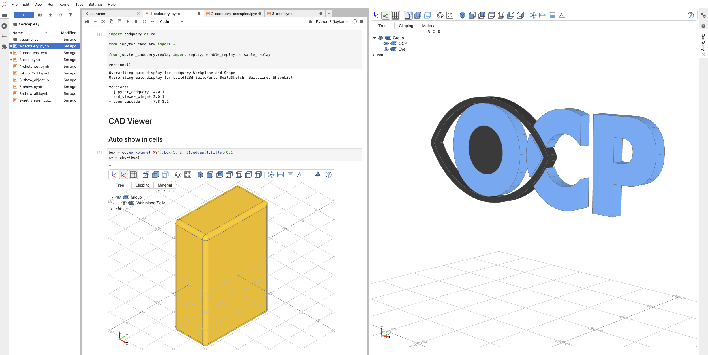

# Jupyter for CadQuery / build123d

The Python package provides a Jupyterlab extension and a JupyterServer extension to view [CadQuery](https://github.com/cadquery/cadquery), [build123d](https://github.com/gumyr/build123d), and [OCP](https://github.com/cadquery/OCP) objects in JupyterLab

Current version: **v5.1.0** (2026-09-11)

The full documentation lives at [bernhard-42.github.io/ocp_viewer_docs](https://bernhard-42.github.io/ocp_viewer_docs/) — the [Jupyter CadQuery chapter](https://bernhard-42.github.io/ocp_viewer_docs/viewers/jupyter_cadquery/overview/) covers this viewer's specifics; this README gets you installed and running, and links into the rest.



Click on the "launch binder" icon to start _Jupyter-CadQuery_ on binder:

[](https://mybinder.org/v2/gh/bernhard-42/jupyter-cadquery/master?urlpath=lab) (**Due to security restrictions, the measurement feature does not work on binder**)

## Installation

- **CadQuery**
  1. Create and activate a virtual conda environment

     ```bash
     mamba create -n jcq python=3.12
     mamba activate jcq
     ```

  2. Install latest cadquery master

     ```bash
     mamba install -c conda-forge -c cadquery cadquery=master
     ```

  3. Install Jupyter CadQuery

     ```bash
     pip install jupyter-cadquery
     ```

- **build123d**
  1. Create and activate a virtual environment (conda, pyenv-virtualenv, uv, ...)

  2. Install build123d

     ```bash
     pip install build123d
     ```

  3. Install Jupyter CadQuery

     ```bash
     pip install jupyter-cadquery
     ```

Jupyter CadQuery requires JupyterLab 4 (`jupyterlab>=4.6.2,<5`) and installs it if it is missing. The JupyterLab extension is prebuilt and ships inside the [cad-viewer-widget](https://github.com/bernhard-42/cad-viewer-widget) dependency: no `jupyter labextension` step, no Node.js.

**Known issue:** ipykernel 7.x can stall a running notebook (a cell stays at `[*]` with an idle kernel). Until the ipykernel release that carries [the fix](https://github.com/ipython/ipykernel/pull/1529), install `pip install "ipykernel<7"` — details and the workaround in [Troubleshooting](https://bernhard-42.github.io/ocp_viewer_docs/viewers/jupyter_cadquery/troubleshooting/#a-cell-stays-at-and-the-kernel-is-idle).

### Verify the installation

```bash
jupyter lab extension list        # must list:  jupyter_cadquery 5.1.0 OK   (the viewer frontend)
jupyter server extension list     # must list:  jupyter_cadquery 5.1.0 OK   (the measurement backend)
```

A line "Extension package jupyter_cadquery took N s to import" is OCP and VTK loading, not an error. On a Mac the very first run can take minutes for the same reason.

## Changed behavior from 4.x

- The complete sidecar space will now be used for the viewer. For the old behaviour set `cad_width` and `height`
- The default for `show` is `reset_camera=Camera.KEEP` now (unless set in ~/.jcq_config differently).
  - The viewer warns if the new object is too large or too small. To disable the warnings, use `ignore_camera_warnings()`
  - The old behavior can be achieved with `set_defaults(reset_camera=Camera.RESET)`
- `from jupyter_cadquery import *` still works. For portable code with other viewers from the ocp viewer ecosystem use `from ocp_viewer_core.viewer import *`
- `mate_scale` does not work any more, use `helper_scale`
- The viewer now remembers paths in the tree that are shown/hidden and will show/hide the same paths for the newly shown CAD object

For all new features and fixes see [CHANGELOG](./CHANGELOG.md)

## First run

```bash
jupyter lab
```

and in a notebook:

```python
from build123d import *
from jupyter_cadquery import *

open_viewer("CAD")
show(Box(1, 2, 3))
```

`open_viewer` puts the viewer into a sidecar panel next to the notebook; without it, `show` draws into the cell. From here on, everything is in the documentation.

## Documentation

The full documentation lives at [bernhard-42.github.io/ocp_viewer_docs](https://bernhard-42.github.io/ocp_viewer_docs/) — the [Jupyter CadQuery chapter](https://bernhard-42.github.io/ocp_viewer_docs/viewers/jupyter_cadquery/overview/) covers this viewer's specifics; everything below is a deep link into it.

### Getting started

- [Overview](https://bernhard-42.github.io/ocp_viewer_docs/viewers/jupyter_cadquery/overview/) — what it does, in pictures
- [Installation](https://bernhard-42.github.io/ocp_viewer_docs/viewers/jupyter_cadquery/installation/)
- [Sidecars, windows and cells](https://bernhard-42.github.io/ocp_viewer_docs/viewers/jupyter_cadquery/addressing/) — [where a viewer lives](https://bernhard-42.github.io/ocp_viewer_docs/viewers/jupyter_cadquery/addressing/#where-a-viewer-lives), [its size](https://bernhard-42.github.io/ocp_viewer_docs/viewers/jupyter_cadquery/addressing/#size), [addressing one of several](https://bernhard-42.github.io/ocp_viewer_docs/viewers/jupyter_cadquery/addressing/#addressing-a-viewer), [managing viewers](https://bernhard-42.github.io/ocp_viewer_docs/viewers/jupyter_cadquery/addressing/#managing-viewers)
- [Best practices for configuring](https://bernhard-42.github.io/ocp_viewer_docs/config/)

### Working in the notebook

- [Working in the notebook](https://bernhard-42.github.io/ocp_viewer_docs/viewers/jupyter_cadquery/notebook/) — [auto display](https://bernhard-42.github.io/ocp_viewer_docs/viewers/jupyter_cadquery/notebook/#auto-display), [reading a pick back into Python](https://bernhard-42.github.io/ocp_viewer_docs/viewers/jupyter_cadquery/notebook/#reading-a-pick-back-into-python), [what the notebook remembers](https://bernhard-42.github.io/ocp_viewer_docs/viewers/jupyter_cadquery/notebook/#what-the-notebook-remembers)
- [Replay](https://bernhard-42.github.io/ocp_viewer_docs/viewers/jupyter_cadquery/replay/) — step through the calls that built a CadQuery object
- [Export](https://bernhard-42.github.io/ocp_viewer_docs/viewers/jupyter_cadquery/export/) — [a viewer as a standalone HTML page](https://bernhard-42.github.io/ocp_viewer_docs/viewers/jupyter_cadquery/export/#a-viewer-as-a-standalone-html-page), [a notebook as HTML](https://bernhard-42.github.io/ocp_viewer_docs/viewers/jupyter_cadquery/export/#a-notebook-as-html), [PNG](https://bernhard-42.github.io/ocp_viewer_docs/viewers/jupyter_cadquery/export/#png)
- [Workspace Config](https://bernhard-42.github.io/ocp_viewer_docs/viewers/jupyter_cadquery/workspace_config/) — the settings in `~/.jcq_config`

### Working with the viewer

- [The CAD Viewer window](https://bernhard-42.github.io/ocp_viewer_docs/viewer/) and [mouse and keys](https://bernhard-42.github.io/ocp_viewer_docs/mouse_keys/)
- [Measurement tools](https://bernhard-42.github.io/ocp_viewer_docs/measure/)
- [Object selection tool](https://bernhard-42.github.io/ocp_viewer_docs/selector/)
- [Physically based rendering Studio](https://bernhard-42.github.io/ocp_viewer_docs/pbr_studio/)
- [ImageFace — use a 2-D image as a reference plane](https://bernhard-42.github.io/ocp_viewer_docs/image_face/)

### Python `show*` commands

- [Use the `show` command](https://bernhard-42.github.io/ocp_viewer_docs/show/)
- [Use the `show_object` command](https://bernhard-42.github.io/ocp_viewer_docs/show_object/)
- [Use the `push_object` and `show_objects` commands](https://bernhard-42.github.io/ocp_viewer_docs/push_object/)
- [Use the `show_all` command](https://bernhard-42.github.io/ocp_viewer_docs/show_all/)
- [Use the `set_viewer_config` command](https://bernhard-42.github.io/ocp_viewer_docs/set_viewer_config/)

### Python API reference

- [Jupyter CadQuery API](https://bernhard-42.github.io/ocp_viewer_docs/viewers/jupyter_cadquery/api/) — `open_viewer`, `close_viewer`, `export_html`, `replay`, `get_pick`, …
- [Additional Python API](https://bernhard-42.github.io/ocp_viewer_docs/api/) (`show_clear`, `save_screenshot`, `status`, …)
- [Animation](https://bernhard-42.github.io/ocp_viewer_docs/animation/)
- [Color maps](https://bernhard-42.github.io/ocp_viewer_docs/colormaps/)
- [Enums reference](https://bernhard-42.github.io/ocp_viewer_docs/enums/) (`Camera`, `Collapse`, `Render`, `AnalysisTool`, `UiTab`, `Studio*`)

### Help

- [Troubleshooting](https://bernhard-42.github.io/ocp_viewer_docs/viewers/jupyter_cadquery/troubleshooting/)
- [How the pieces fit together](https://bernhard-42.github.io/ocp_viewer_docs/viewers/jupyter_cadquery/concepts/)

## Demo Notebooks

Standard examples

- [A run through of many features](./examples/1-cadquery.ipynb)
- [Standard CadQuery examples in Jupyter CadQuery](./examples/2-cadquery-examples.ipynb)
- [An OCP example (the OCC bottle)](./examples/3-occ.ipynb)
- [CadQuery Sketch support](./examples/4-sketches.ipynb)
- [build123d examples](./examples/5-build123d.ipynb)

Animated examples (requires `pip install cadquery-massembly matplotlib`):

- [Rotating disk arm](./examples/assemblies/1-disk-arm.ipynb)
- [Hexapod](./examples/assemblies/2-hexapod.ipynb)
- [Jansen Linkage](./examples/assemblies/3-jansen-linkage.ipynb)
- [CadQuery's door assembly example](./examples/assemblies/5-door.ipynb)
- [A nested Assembly](./examples/assemblies/6-nested-assemblies.ipynb)

## Changes

see [CHANGELOG.md](./CHANGELOG.md)

## Licence

Apache-2.0.
